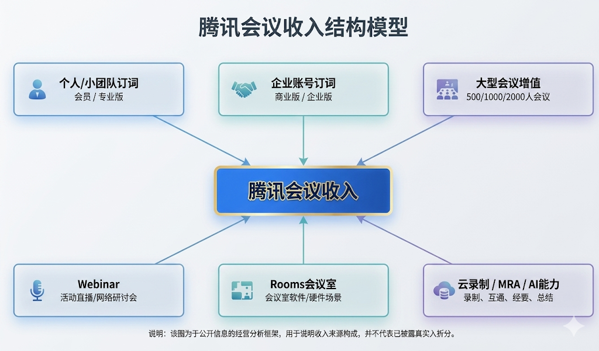
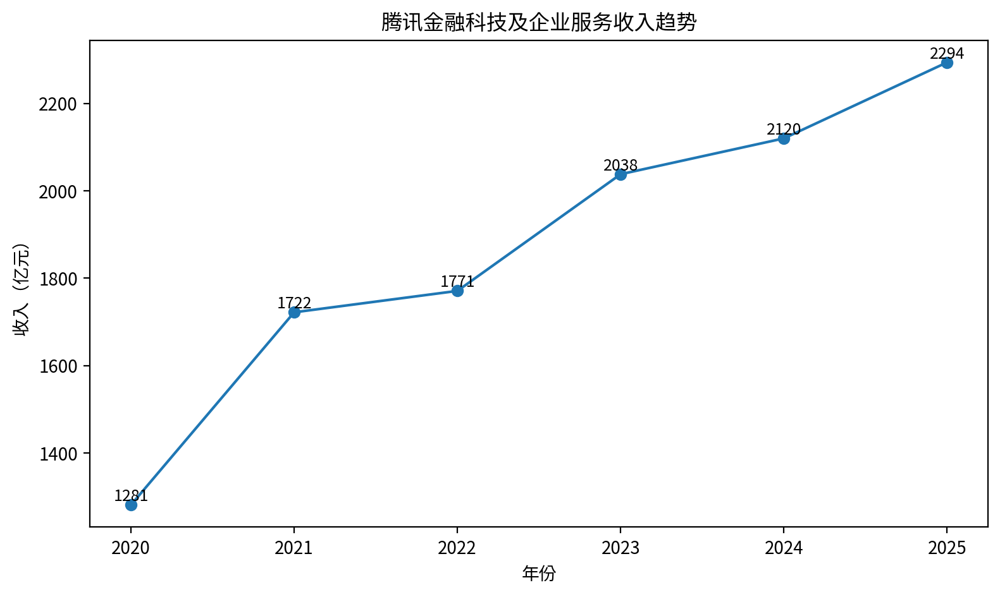
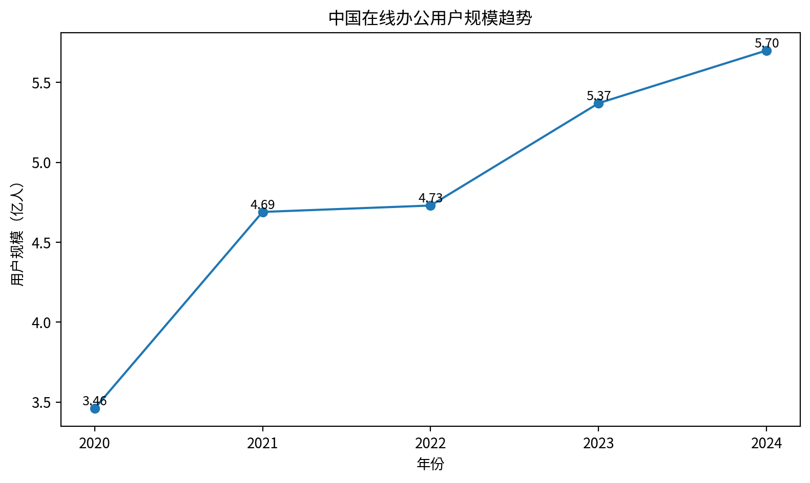

# 腾讯会议业务经营分析简报

> **核心内容**：基于公开数据的用户增长、商业化信号、行业空间与竞品路径分析  
> **汇报人**：XXX  
> **日期**：2026年X月X日  
> **数据来源**：腾讯会议官网、腾讯财报、IDC、CNNIC、竞品公开披露、权威媒体报道等  

---

## 目录

1. [执行摘要](#1-执行摘要)
2. [数据口径与分析方法](#2-数据口径与分析方法)
3. [腾讯会议用户规模分析](#3-腾讯会议用户规模分析)
4. [使用、生态与商业化信号](#4-使用生态与商业化信号)
5. [腾讯会议收入结构模型](#5-腾讯会议收入结构模型)
6. [腾讯 ToB 板块背景](#6-腾讯-tob-板块背景)
7. [行业空间分析](#7-行业空间分析)
8. [竞品路径对比](#8-竞品路径对比)
9. [增长机会洞察](#9-增长机会洞察)
10. [数据缺口与后续验证](#10-数据缺口与后续验证)
11. [AI 使用说明](#11-ai-使用说明)
12. [附录：核心指标表](#12-附录核心指标表)

---

# 1. 摘要

本报告基于公开数据，对腾讯会议的用户增长、商业化信号、行业空间与竞品路径进行经营分析。由于腾讯会议并非独立披露主体，公开渠道无法完整获得收入、付费企业数、ARPU、续费率等内部经营指标，因此本文采用“公开披露关键节点 + 商业化信号 + 腾讯 ToB 板块背景 + 行业市场数据 + 竞品公开数据”的方式进行交叉分析。

## 1.1 核心结论

**结论一：腾讯会议已完成 4 亿级用户规模积累。**  
公开数据显示，腾讯会议用户规模在 2020—2023 年持续突破关键节点：2020 年超 1 亿、2021 年超 2 亿、2022 年超 3 亿、2023 年突破 4 亿。该指标为累计用户数或用户规模节点，不等同于 MAU 或 DAU，但能够说明产品已完成大规模市场渗透。

**结论二：腾讯会议商业化信号逐步增强。**  
2023 年腾讯会议付费用户数同比提升 5 倍，代理收入同比增长 200%，生态伙伴数从 2022 年超 100 家增长至 2023 年超 300 家；2024 年 AI 功能 MAU 达到 1,500 万。这些信号说明，腾讯会议正在从会议连接工具，逐步拓展到企业级付费服务、生态合作和 AI 会议能力。

**结论三：视频会议直接市场趋稳，在线办公与 AI 办公提供外延增长空间。**  
中国视频会议市场从 2020 年约 9.5 亿美元到 2024 年约 9.8 亿美元，直接市场增长有限；但中国在线办公用户规模从 2020 年约 3.46 亿增长至 2024 年约 5.70 亿，说明在线协同和远程办公习惯已经沉淀。腾讯会议后续增长不应只来自“更多会议”，而应来自“会议后的协同、任务和知识沉淀”。

**结论四：竞品路径分化明显。**  
钉钉偏组织管理入口，飞书偏效率协同与知识管理，Zoom 偏视频会议 SaaS 商业化，Teams 偏办公套件生态绑定。腾讯会议的路径是以会议入口为核心，结合企业微信、腾讯文档、腾讯云和 AI 能力，形成腾讯生态内的协同办公场景。

**结论五：腾讯会议未来增长机会在“会议入口 + 腾讯生态 + AI 能力”。**  
未来增长重点应从单一会议连接，升级为 AI 会议生产力平台：通过实时转写、智能纪要、待办提取、会议问答、知识沉淀等能力，提高企业客户的使用深度和付费价值。

---

# 2. 数据口径与分析方法

## 2.1 数据来源

本报告使用的公开数据主要来自以下渠道：

| 数据类型 | 主要来源 | 用途 |
|---|---|---|
| 腾讯会议直接披露数据 | 腾讯会议官网、腾讯官方新闻、权威媒体转述 | 用户规模、使用规模、AI 功能使用 |
| 商业化信号数据 | 腾讯会议公开发布、媒体报道 | 付费用户增速、代理收入增速、收入同比信号 |
| 腾讯板块数据 | 腾讯财报、年报、投资者材料 | ToB 业务背景 |
| 行业市场数据 | IDC、CNNIC、艾瑞咨询、艾媒咨询等 | 判断外部市场空间 |
| 竞品公开数据 | Zoom 财报、钉钉/飞书发布会、微软官方披露等 | 对比不同企业服务路径 |

## 2.2 数据处理原则

为避免公开数据误用，本报告采用以下处理原则：

1. **不对未公开数据进行编造、插值或平均拆分。**  
   对于腾讯会议收入绝对值、付费企业数、ARPU、续费率等指标，统一标注为未公开披露。

2. **不同机构口径的数据不强行合并为同一趋势线。**  
   如协同办公市场规模存在艾瑞、艾媒等不同机构口径，本文仅在必要时作为辅助说明。

## 2.3 五层公开数据框架

| 数据层级 | 数据类型 | 分析用途 |
|---|---|---|
| 第一层 | 腾讯会议直接披露数据 | 观察用户规模、使用规模、AI 功能使用 |
| 第二层 | 商业化信号数据 | 观察付费转化、渠道收入、生态合作 |
| 第三层 | 腾讯板块数据 | 观察腾讯 ToB 业务背景 |
| 第四层 | 行业市场数据 | 判断直接市场与外延市场空间 |
| 第五层 | 竞品公开数据 | 对比不同企业服务路径 |

---

# 3. 腾讯会议用户规模分析

## 3.1 用户规模节点

腾讯会议在 2020—2023 年持续突破用户规模节点：

| 年份 | 用户规模节点 | 口径说明 |
|---|---:|---|
| 2020 | 1 亿+ | 累计用户数 / 用户规模节点 |
| 2021 | 2 亿+ | 累计用户数 / 用户规模节点 |
| 2022 | 3 亿+ | 累计用户数 / 用户规模节点 |
| 2023 | 4 亿+ | 累计用户数 / 用户规模节点 |


## 3.2 图表解读

腾讯会议在 2020—2023 年完成从 1 亿级到 4 亿级的用户规模跃迁，说明产品已经实现大规模市场渗透。该指标为公开披露的累计用户数或用户规模节点，不等同于 MAU 或 DAU，因此该图用于展示规模里程碑，不用于计算活跃用户增长率。

## 3.3 经营含义

用户规模积累为后续商业化和生态扩展提供基础。2024 年后，腾讯会议未持续公开披露用户总量，后续经营分析不应只看用户规模，而应进一步关注企业客户转化、AI 功能使用和生态协同价值。

---

# 4. 使用、生态与商业化信号

腾讯会议公开数据并不是完整连续的经营报表，但多个关键指标可以反映产品价值从“会议连接”向“企业协同、开放生态和 AI 功能使用”延伸。

## 4.1 关键经营信号

| 类别 | 指标 | 数据 | 解读 |
|---|---|---:|---|
| 使用规模 | 年度会议场次 | 2020 年超 3 亿场 | 早期高频使用 |
| 使用规模 | 年度参会次数 | 2021 年超 40 亿次 | 大规模参会行为 |
| 协同延伸 | 累计在线协同次数 | 2023 年超 25 亿次 | 从会议向协同延伸 |
| 开放生态 | API 日均调用次数 | 2023 年过千万 | 开放平台能力增强 |
| 生态合作 | 生态伙伴数 | 2022 超 100 家 → 2023 超 300 家 | 生态合作扩大 |
| 付费转化 | 付费用户同比 | 2023 年提升 5 倍 | 付费转化信号 |
| AI 使用 | AI 功能 MAU | 2024 年 1,500 万 | AI 功能形成使用基础 |

## 4.2 分析解读

作为关键经营信号，上述指标共同说明：

1. **高频会议使用已经形成产品基础。**
2. **API 调用与生态伙伴增长说明腾讯会议开始平台化。**
3. **AI 功能 MAU 体现会议内容处理能力正在成为新的价值入口。**

---

# 5. 腾讯会议收入结构模型

## 5.1 收入结构拆解

由于腾讯会议未单独披露收入绝对值，本报告不做确定性收入估算，而是通过公开产品形态构建收入结构模型：

```text
腾讯会议收入 =
个人 / 小团队订阅
+ 企业账号订阅
+ 大型会议增值服务
+ Webinar
+ Rooms 会议室
+ 云录制 / MRA
+ AI 小助手与智能纪要等 AI 能力
```



## 5.2 收入来源说明

| 收入来源 | 说明 |
|---|---|
| 个人 / 小团队订阅 | 会员、专业版 |
| 企业账号订阅 | 商业版、企业版 |
| 大型会议增值 | 500 人、1000 人、2000 人会议 |
| Webinar | 活动直播、网络研讨会 |
| Rooms 会议室 | 会议室软件、会议室硬件场景 |
| 云录制 / MRA | 录制存储、会议室连接器 |
| AI 能力 | AI 小助手、智能纪要、实时转写、总结问答 |

## 5.3 图表解读

基础会议能力负责获客和使用频次；企业账号订阅提供稳定收入基础；大型会议、Webinar、Rooms、云录制等功能提升客单价；AI 能力有机会成为版本升级和增购入口。


---

# 6. 腾讯 ToB 板块背景

## 6.1 金融科技及企业服务收入趋势

腾讯金融科技及企业服务板块整体保持增长，为腾讯会议所在的企业服务生态提供业务背景。




## 6.2 图表解读

腾讯金融科技及企业服务板块从 2020 年 1,281 亿元增长到 2025 年 2,294 亿元，体现腾讯 ToB 与企业服务相关业务的整体背景。

但该板块包含支付、理财、云服务、企业服务等多类业务，腾讯会议只是其中一部分，因此不能代表腾讯会议收入。


---

# 7. 行业空间分析

## 7.1 在线办公用户规模趋势




## 7.2 图表解读

中国在线办公用户规模从 2020 年约 3.46 亿增长至 2024 年约 5.70 亿，说明在线协同和远程办公习惯已经沉淀。腾讯会议后续增长不应只依赖会议次数增长，而应延伸至协同办公与 AI 办公场景。

## 7.3 直接市场与外延市场

| 市场 | 数据 | 判断 |
|---|---:|---|
| 中国视频会议市场 | 2020 约 9.5 亿美元，2024 约 9.8 亿美元 | 直接市场增长有限 |
| 中国云会议市场 | 2020 约 2.6 亿美元，2024 约 3.0 亿美元 | 云会议仍有增长 |
| 中国在线办公用户 | 2024 约 5.70 亿 | 用户基础扩大 |
| 企业级 SaaS 市场 | 2020 约 538 亿元，2024 约 888 亿元 | 外延空间更大 |

## 7.4 小结

视频会议直接市场已经进入相对稳定阶段，但在线办公、企业 SaaS 和 AI 办公仍提供更大外延空间。腾讯会议的增长重点应从“开会”延伸到“会议后的协同、任务和知识沉淀”。

---

# 8. 竞品路径对比

企业协同产品并不是单一维度竞争，而是不同入口、场景和商业化路径的竞争。

## 8.1 竞品关键指标

| 产品 | 代表性指标 | 路径特征 |
|---|---|---|
| 腾讯会议 | 2023 年累计用户数 4 亿+ | 会议入口 + 腾讯生态 |
| 钉钉 | 2023 年软件付费企业 12 万 | 组织管理入口 |
| 飞书 | 2024E ARR 3 亿美元+ | 效率协同与知识管理 |
| Zoom | FY2025 收入 46.65 亿美元 | 视频会议 SaaS 商业化 |
| Teams | 2024 年 MAU 约 3.2 亿 | 办公套件生态绑定 |


## 8.2 路径解读

| 产品 | 路径解读 |
|---|---|
| 腾讯会议 | 以会议入口为核心，连接企业微信、腾讯文档、腾讯云和 AI 能力 |
| 钉钉 | 以组织管理为入口，覆盖企业通讯、审批、组织流程和 AI 应用 |
| 飞书 | 以效率协同和知识管理为入口，强调文档、项目协作和企业知识沉淀 |
| Zoom | 以视频会议 SaaS 为核心商业化路径，收入与大客户指标披露较完整 |
| Teams | 依托 Office 办公生态绑定会议、协作和企业办公场景 |

## 8.3 小结

不同企业服务产品的核心路径不同：钉钉偏组织入口，飞书偏效率协同，Zoom 偏会议 SaaS，Teams 偏办公生态。腾讯会议的路径是“会议入口 + 腾讯生态 + AI 能力”。

---

# 9. 增长机会洞察

腾讯会议未来增长不应只围绕“更多会议次数”，而应围绕“会议内容资产化与企业协同流程化”。

## 9.1 机会一：AI 会议助手提升付费价值

会议本身不是终点。企业真正愿意付费的价值在于会议前、中、后的效率提升。

```text
实时转写 → 智能纪要 → 待办提取 → 会议问答 → 知识沉淀
```

AI 能力可以让腾讯会议从“音视频连接工具”升级为“会议内容处理与企业知识沉淀工具”。

## 9.2 机会二：企业客户分层运营

| 客户类型 | 核心需求 | 产品策略 |
|---|---|---|
| 个人 / 小团队 | 时长、录制、参会人数 | 会员 / 专业版 |
| 中小企业 | 权限、账号、Webinar | 商业版 + 增值服务 |
| 大型企业 | 安全、会议室、系统集成 | 企业版 + Rooms + MRA |

## 9.3 机会三：腾讯生态协同

腾讯会议可以通过以下产品形成协同：

```text
腾讯会议 + 企业微信 + 腾讯文档 + 腾讯云 + 混元大模型
```

这种协同可以把会议中的信息进一步转化为文档、待办、知识库和业务流程，从而提升企业客户使用深度与粘性。

## 9.4 增长逻辑

```text
AI 能力增强
→ 企业付费升级
→ 生态协同沉淀
→ 使用深度提升
→ AI 能力继续增强
```

---

# 10. 数据缺口与后续验证

公开数据适合判断业务方向和外部位置；如果进入真实经营会，需进一步结合订单、CRM、财务和产品埋点数据验证收入规模、转化效率和客户粘性。

## 数据缺口表

| 缺失指标 | 重要性 | 后续内部验证方式 |
|---|---|---|
| 腾讯会议收入绝对值 | 判断业务规模 | 财务收入台账 |
| 付费用户数 | 判断转化效率 | 会员 / 订单系统 |
| 付费企业数 | 判断 ToB 商业化 | CRM / 合同系统 |
| ARPU | 判断客户价值 | 收入 / 付费客户 |
| 续费率 | 判断客户粘性 | 订阅续费数据 |
| AI 功能转化率 | 判断 AI 商业化价值 | AI 功能使用与付费版本关联 |

---

# 11. AI 使用说明

## 11.1 使用工具与环节

| 环节 |AI工具| AI 使用方式 |
|---|---| ---|
| 任务拆解 |  ChatGPT | 阅读项目要求，拆分数据采集、整理、分析、报告输出 |
| 数据采集 | ChatGPT、Workbuddy、Gemini |检索腾讯会议、腾讯财报、IDC、CNNIC、竞品公开数据 |
| 数据清洗 | ChatGPT | 比对不同来源，区分数据口径 |
| 数据整理 | ChatGPT | 生成 CSV、Excel、Markdown 数据文件 |
| 图表生成 | ChatGPT、Gemini| 基于结构化数据生成核心图表 |
| 报告撰写 | ChatGPT、Workbuddy | 生成经营分析初稿，并人工复核 |


## 11.2 人工校验说明

AI 主要用于提升信息检索、结构化整理和报告生成效率；最终数据口径、可用性判断和业务结论经过人工校验。AI 输出未直接作为最终结论，关键指标均经过人工复核与口径清洗。

---

# 12. 附录：核心指标表

## 12.1 腾讯会议核心指标

| 指标 | 数据 | 用途 |
|---|---:|---|
| 累计用户数 | 2020 超 1 亿、2021 超 2 亿、2022 超 3 亿、2023 超 4 亿 | 用户规模节点 |
| 年度会议场次 | 2020 年超 3 亿场 | 使用规模 |
| 年度参会次数 | 2021 年超 40 亿次 | 使用规模 |
| 累计在线协同次数 | 2023 年超 25 亿次 | 协同延伸 |
| API 日均调用次数 | 2023 年过千万 | 开放生态 |
| 生态伙伴数 | 2022 超 100 家、2023 超 300 家 | 生态合作 |
| 付费用户同比 | 2023 年提升 5 倍 | 商业化信号 |
| AI 功能 MAU | 2024 年 1,500 万 | AI 使用 |

## 12.2 腾讯板块指标

| 指标 | 2020 | 2021 | 2022 | 2023 | 2024 | 2025 |
|---|---:|---:|---:|---:|---:|---:|
| 金融科技及企业服务收入 | 1,281 亿元 | 1,722 亿元 | 1,771 亿元 | 2,038 亿元 | 2,120 亿元 | 2,294 亿元 |

> 注：该指标不能代表腾讯会议收入。

## 12.3 行业指标

| 指标 | 数据 |
|---|---:|
| 中国视频会议市场 | 2020 约 9.5 亿美元，2024 约 9.8 亿美元 |
| 中国云会议市场 | 2020 约 2.6 亿美元，2024 约 3.0 亿美元 |
| 中国在线办公用户 | 2020 约 3.46 亿，2024 约 5.70 亿 |
| 中国企业级 SaaS 市场 | 2020 约 538 亿元，2024 约 888 亿元 |

## 12.4 竞品指标

| 产品 | 代表性数据 |
|---|---|
| 钉钉 | 2023 年软件付费企业 12 万 |
| 飞书 | 2024E ARR 3 亿美元+ |
| Zoom | FY2025 收入 46.65 亿美元 |
| Teams | 2024 年 MAU 约 3.2 亿 |

---

# 结语

基于公开数据，腾讯会议已经完成大规模用户积累，并出现付费用户增长、生态伙伴扩展、AI 功能使用等商业化信号。未来腾讯会议的核心增长机会，不应仅限于会议连接本身，而应围绕“会议入口 + 腾讯生态 + AI 能力”，进一步向企业级 AI 会议生产力平台演进。
